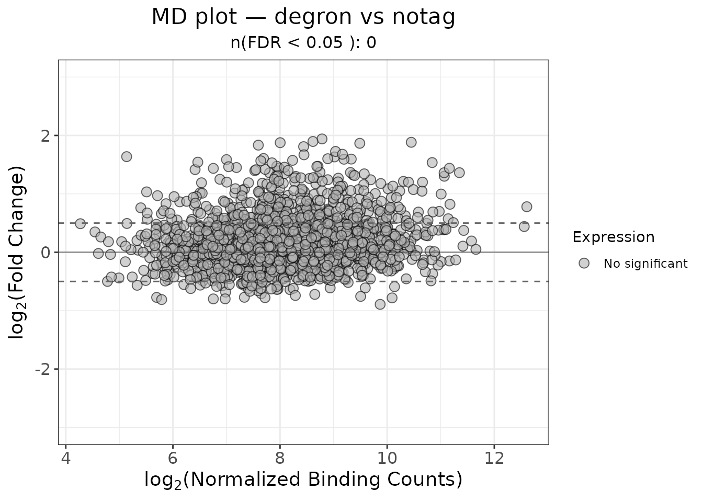
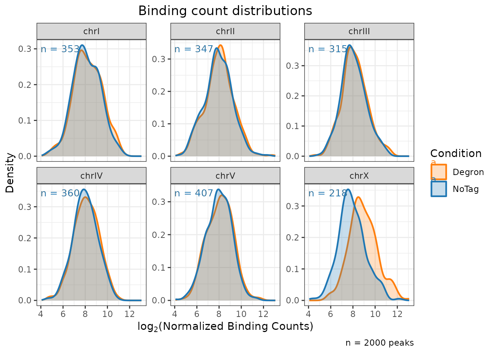
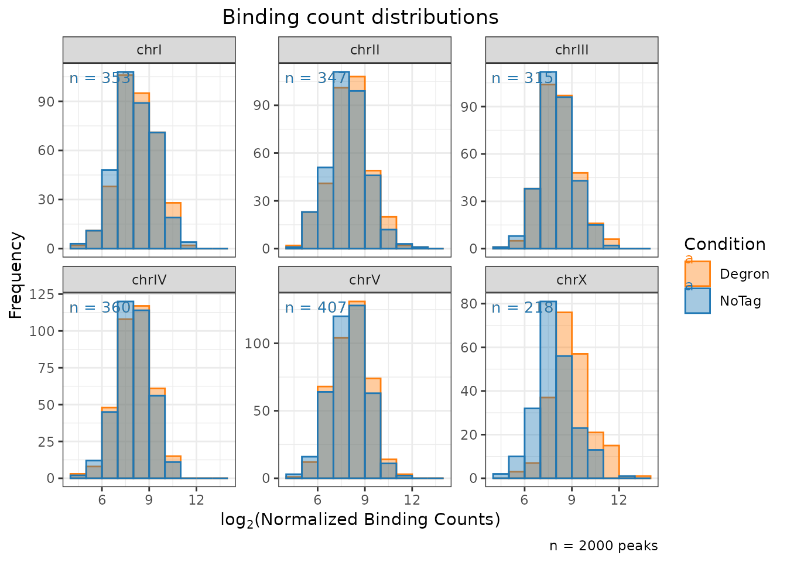
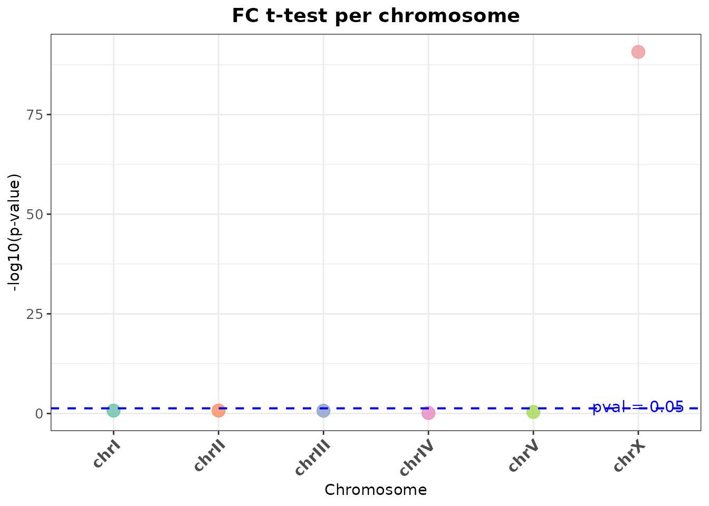

# Diagnostic plots

``` r
library(ercantools)
library(magrittr)
data(example_peaks)
```

## `plot_md()`

Plots log2 fold-change against average concentration. Points are
coloured by significance status.

``` r
plot_md(
  object     = example_peaks,
  x_var      = "Conc",
  y_var      = "Fold",
  fdr_var    = "FDR",
  cutoff_y   = 0.5,
  cutoff_FDR = 0.05,
  title      = "MD plot — degron vs notag"
)
```



## `plot_distributions()`

Density or histogram of normalized binding counts faceted by chromosome.

``` r
plot_distributions(
  object    = example_peaks,
  title     = "Binding count distributions",
  condition = "Degron",
  baseline  = "NoTag",
  type      = "density"
)
```



``` r
plot_distributions(
  object    = example_peaks,
  title     = "Binding count distributions",
  condition = "Degron",
  baseline  = "NoTag",
  type      = "hist"
)
```



## `ttest_scatter()`

T-test comparing log2(fold-change) distribution of ChrA vs ChrA and ChrX
vs ChrA.

``` r
res <- ttest_scatter(
  object   = example_peaks,
  title    = "FC t-test per chromosome",
  fc_col   = "Fold"
)
res$plot
```



The underlying data is also accessible:

``` r
res$results
#>   Condition      p_value chr_to_evaluate       comparison_type mean_target
#> 1      chrI 1.888820e-01            chrI Autosome vs Autosomes  0.11456884
#> 2     chrII 1.860554e-01           chrII Autosome vs Autosomes  0.07455821
#> 3    chrIII 1.966083e-01          chrIII Autosome vs Autosomes  0.11629048
#> 4     chrIV 7.369995e-01           chrIV Autosome vs Autosomes  0.08977472
#> 5      chrV 4.148876e-01            chrV Autosome vs Autosomes  0.08367961
#> 6      chrX 1.963583e-91            chrX        X vs Autosomes  0.99258303
#>   mean_reference neg_log10_pvalue is_significant
#> 1     0.09018873        0.7238094          FALSE
#> 2     0.09996571        0.7303578          FALSE
#> 3     0.09045058        0.7063983          FALSE
#> 4     0.09634571        0.1325328          FALSE
#> 5     0.09837447        0.3820696          FALSE
#> 6     0.09501824       90.7069507           TRUE
```
