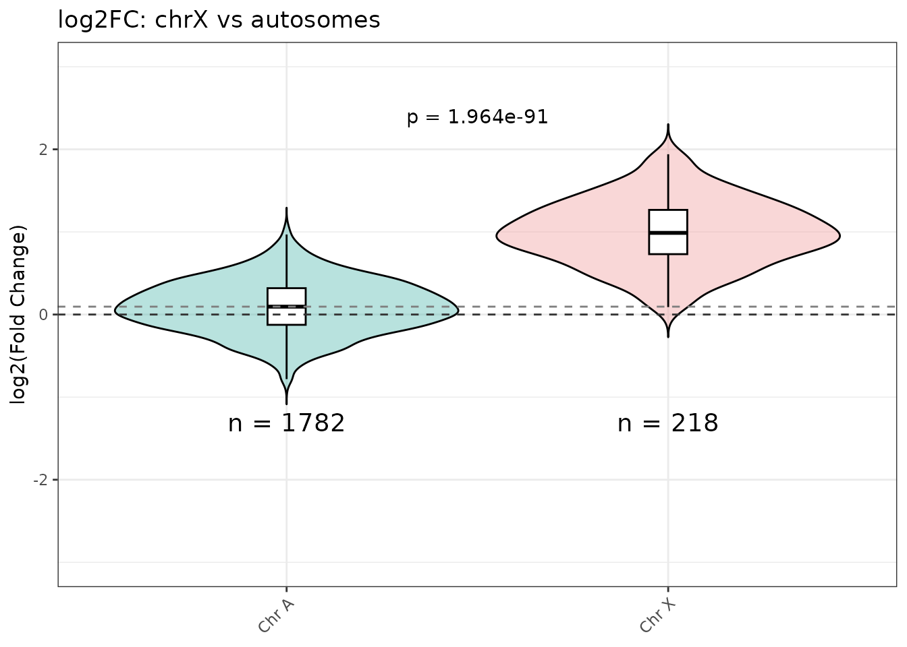
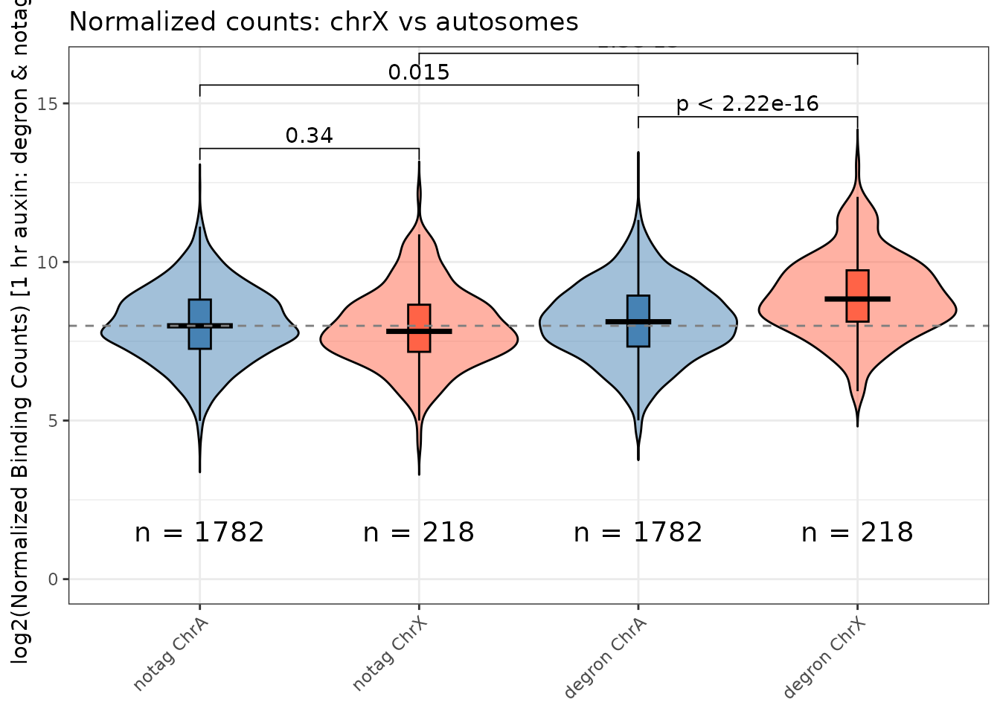
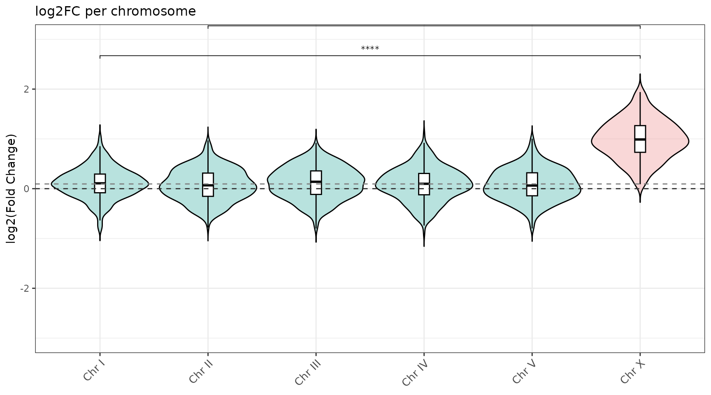
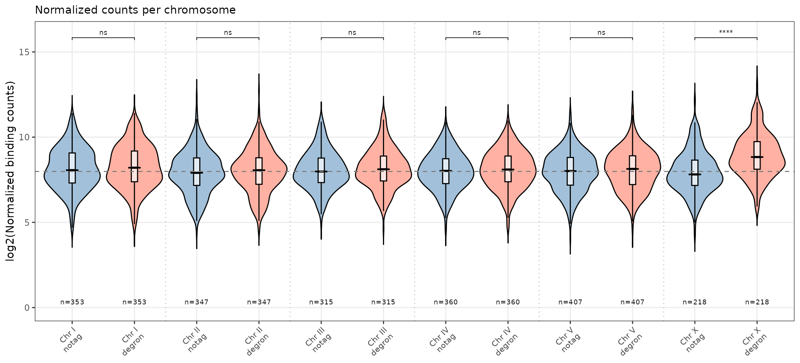

# Violin plots

``` r
library(ercantools)
library(magrittr)
data(example_peaks)
```

## Overview

The violin functions compare binding distributions between chromosomes.
Four functions cover the main use cases:

| Function                                                                                              | Y-axis            | Groups                          |
|-------------------------------------------------------------------------------------------------------|-------------------|---------------------------------|
| [`violin_log2FC()`](https://ercanlab.github.io/ercantools/reference/violin_log2FC.md)                 | log2FC            | chrX vs pooled autosomes        |
| [`violin_counts()`](https://ercanlab.github.io/ercantools/reference/violin_counts.md)                 | Normalized counts | chrX vs autosomes, 2 conditions |
| [`violin_log2FC_all_chr()`](https://ercanlab.github.io/ercantools/reference/violin_log2FC_all_chr.md) | log2FC            | Each chromosome separately      |
| [`violin_counts_all_chr()`](https://ercanlab.github.io/ercantools/reference/violin_counts_all_chr.md) | Normalized counts | Each chromosome x 2 conditions  |

## `violin_log2FC()`

Compares chrX peaks against all autosomes pooled. A Welch t-test p-value
is annotated automatically.

``` r
violin_log2FC(
  object          = example_peaks,
  title           = "log2FC: chrX vs autosomes",
  ylab            = "log2(Fold Change)",
  chr_of_interest = "chrX",
  ylim            = c(-3, 3),
  pvalue_y_position = 2.5
)
```



## `violin_counts()`

Shows four groups: baseline-A, baseline-X, condition-A, condition-X.

``` r
violin_counts(
  object           = example_peaks,
  title            = "Normalized counts: chrX vs autosomes",
  conc_condition   = "Conc_degron",
  condition_name   = "degron",
  conc_baseline    = "Conc_notag",
  baseline_name    = "notag",
  ylim             = c(0, 16),
  label.y_plot     = c(13, 14, 15, 16)
)
#> Warning: Using `size` aesthetic for lines was deprecated in ggplot2 3.4.0.
#> ℹ Please use `linewidth` instead.
#> ℹ The deprecated feature was likely used in the ercantools package.
#>   Please report the issue at <https://github.com/ercanlab/ercantools/issues>.
#> This warning is displayed once per session.
#> Call `lifecycle::last_lifecycle_warnings()` to see where this warning was
#> generated.
```



## `violin_log2FC_all_chr()`

One violin per chromosome with significance brackets vs chrX.

``` r
violin_log2FC_all_chr(
  object          = example_peaks,
  title           = "log2FC per chromosome",
  ylab            = "log2(Fold Change)",
  chr_of_interest = "chrX",
  ylim            = c(-3, 3)
)
```



## `violin_counts_all_chr()`

Two paired violins per chromosome separated by condition.

``` r
violin_counts_all_chr(
  object           = example_peaks,
  title            = "Normalized counts per chromosome",
  conc_condition   = "Conc_degron",
  condition_name   = "degron",
  conc_baseline    = "Conc_notag",
  baseline_name    = "notag",
  ylim             = c(0, 16)
)
```


