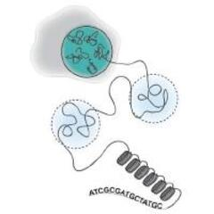

# ercantools 

## Overview

`ercantools` is an R package providing a suite of visualization and
statistical analysis functions for ChIP-seq differential binding data.
It is designed to work directly with
[DiffBind](https://bioconductor.org/packages/DiffBind/) output and
focuses on dosage compensation analysis in *C. elegans*, comparing
binding patterns on the X chromosome versus autosomes.

The package bundles functions for violin plots, MA/MD plots,
distribution plots, chromosome-level t-test scatter plots, and genomic
peak overlap utilities, all designed to produce publication-ready
figures with minimal setup.

------------------------------------------------------------------------

## Installation

### Prerequisites

`ercantools` depends on two Bioconductor packages. Install them before
installing the package:

``` r
if (!requireNamespace("BiocManager", quietly = TRUE))
  install.packages("BiocManager")

BiocManager::install(c("GenomicRanges", "IRanges", "S4Vectors"))
```

### Install from GitHub

``` r
# install.packages("devtools")
devtools::install_github("ercanlab/ercantools")
```

### Install the development branch

``` r
devtools::install_github("ercanlab/ercantools", ref = "develop")
```

------------------------------------------------------------------------

## Quick start

``` r
library(ercantools)

# Load the built-in example dataset (mimics DiffBind output)
data(example_peaks)
head(example_peaks)

# Compare log2FC between chrX and autosomes
violin_log2FC(
  object          = example_peaks,
  title           = "log2FC: chrX vs autosomes",
  chr_of_interest = "chrX",
  ylim            = c(-3, 3)
)
```

------------------------------------------------------------------------

## Features

- **Violin + box plots**: compare log2 fold-change or normalized binding
  counts between chromosomes.
- **MA / MD plots**: visualize log2 fold-change against average
  concentration(normalized binding counts) with significance coloring.
- **Distribution plots**: density and histogram plots of normalized
  binding counts per condition, faceted by chromosome.
- **T-test scatter plots**: chromosome-level Welch t-tests displayed as
  connected scatter plots to identify which chromosomes change
  significantly between conditions.
- **Peak overlap utilities**: GenomicRanges-based overlap detection
  using midpoint windows, plus UpSet plots for multi-category
  intersection visualization.
- **C. elegans defaults**: built-in chromosome ordering (chrI–V, chrX)
  with fully configurable parameters for other organisms.
- **Example dataset**: 2,000 synthetic peaks mimicking real DiffBind
  output for *C. elegans* dosage compensation experiments.

------------------------------------------------------------------------

## Documentation

Full documentation is available at the pkgdown website:

**<https://ercanlab.github.io/ercantools/>**

### Vignettes

| Vignette                                                                                 | Description                                         |
|------------------------------------------------------------------------------------------|-----------------------------------------------------|
| [Violin plots](https://ercanlab.github.io/ercantools/articles/violin-plots.html)         | Comparing binding distributions between chromosomes |
| [Diagnostic plots](https://ercanlab.github.io/ercantools/articles/diagnostic-plots.html) | MD plots, distributions, and t-test scatter plots   |

### Function reference

Access the documentation for any function directly in R:

``` r
?violin_log2FC
?plot_md
?find_overlap_peaks
```

Or browse the full reference at:
<https://ercanlab.github.io/ercantools/reference/>

------------------------------------------------------------------------

## Usage examples

### 1. Violin plot — all chromosomes (log2FC)

``` r
violin_log2FC_all_chr(
  object          = example_peaks,
  title           = "log2FC per chromosome",
  chr_of_interest = "chrX",
  ylim            = c(-3, 3),
  output_pdf      = "violin_all_chr.pdf"
)
```

### 2. Violin plot — normalized counts, two conditions

``` r
violin_counts(
  object           = example_peaks,
  title            = "Normalized counts: chrX vs autosomes",
  conc_condition   = "Conc_degron",
  condition_name   = "degron",
  conc_baseline    = "Conc_notag",
  baseline_name    = "notag",
  ylim             = c(0, 16),
  label.y_plot     = c(13, 14, 15, 16)
)
```

### 3. MA / MD plot

``` r
plot_md(
  object     = example_peaks,
  x_var      = "Conc",
  y_var      = "Fold",
  fdr_var    = "FDR",
  cutoff_y   = 1,
  cutoff_FDR = 0.05,
  title      = "MD plot — degron vs notag"
)
```

### 4. T-test scatter — which chromosomes change?

``` r
res <- ttest_scatter(
  object   = example_peaks,
  title    = "FC t-test per chromosome",
  fc_col   = "Fold"
)
res$plot
head(res$results)
```

### 5. Peak overlap detection

``` r
peaks_x <- example_peaks[example_peaks$seqnames == "chrX", ]
peaks_a <- example_peaks[example_peaks$seqnames != "chrX", ]

overlap <- find_overlap_peaks(peaks_x, peaks_a, bp_distance = 200)
cat("Overlap:", overlap$df2_percentage, "\n")
```

------------------------------------------------------------------------

## Contributing

Contributions are welcome! Please follow these steps:

### Reporting issues

Open an issue at <https://github.com/ercanlab/ercantools/issues> and
include:

- A minimal reproducible example (use `example_peaks` if possible)
- Your R version (`R.version.string`)
- Your `ercantools` version (`packageVersion("ercantools")`)

### Pull requests

1.  Fork the repository and create a new branch from `main`:

    ``` bash
    git checkout -b feature/your-feature-name
    ```

2.  Make your changes and add tests if applicable.

3.  Run the full check locally before submitting:

    ``` r
    devtools::document()
    devtools::check()
    ```

4.  Open a pull request with a clear description of the changes.

### Code style

- Follow the [tidyverse style guide](https://style.tidyverse.org/)
- Use `snake_case` for function and variable names
- Document all exported functions with
  [roxygen2](https://roxygen2.r-lib.org/) tags
- Maximum 80 characters per line
- Use `ggplot2::` prefixes (not
  [`library(ggplot2)`](https://ggplot2.tidyverse.org)) inside functions

### Running tests

``` r
devtools::test()
```

------------------------------------------------------------------------

## Citation

If you use `ercantools` in your research, please cite:

``` bibtex
@misc{garbozo2025ercantools,
  author  = {Garbozo, Daniel and Ercan, Sevinc},
  title   = {{ercantools}: Visualization and Analysis Tools for
             {ChIP}-seq Differential Binding Data},
  year    = {2025},
  url     = {https://github.com/ercanlab/ercantools},
  note    = {R package version 0.1.0}
}
```

------------------------------------------------------------------------

## License

MIT © Daniel Garbozo — see
[LICENSE](https://ercanlab.github.io/ercantools/LICENSE) for details.

------------------------------------------------------------------------

## Acknowledgments

- [Ercan Lab](https://sites.google.com/site/ercanlab/research) — New
  York University, for the biological context and experimental data that
  motivated this package. —

## Roadmap

Planned features for future versions:

- `plot_pca()` — PCA based on normalized binding counts
- `plot_heatmap()` — binding signal heatmap across conditions
- `plot_igv_track()` — IGV-style genome browser track plots
- `plot_cluster()` — peak clustering visualization
- Support for additional organisms beyond *C. elegans*
